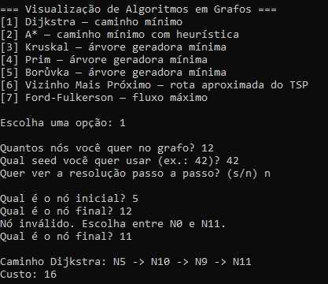
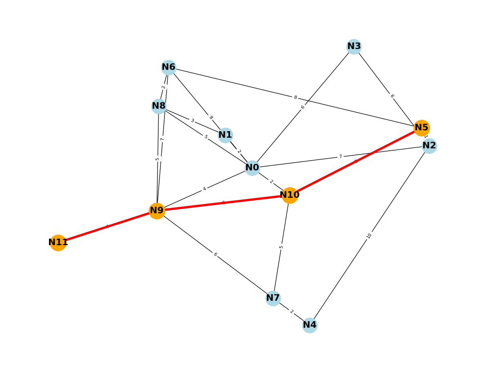
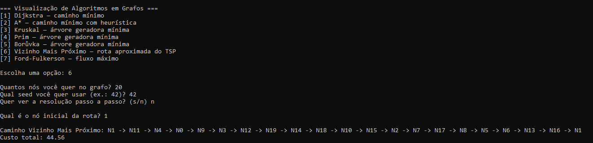
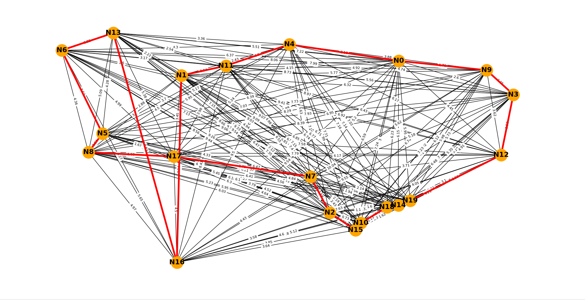

# Visualização de grafos com algoritimos para caminho mínimo | Fluxo máximo | MST | TSP | VRP

Algoritmos de caminho mínimo, árvore geradora mínima, TSP e fluxo máximo,
com visualização interativa dos grafos e da resolução passo a passo.

## Como rodar

A partir da raiz do projeto, Primeiro instale as dependências:

```bash
pip install -r requirements.txt
```
E depois execute a aplicação
```bash
python app.py
```

O programa vai perguntar, em sequência:

1. **Algoritmo** a executar:
   - `[1]` Dijkstra — caminho mínimo
   - `[2]` A\* — caminho mínimo com heurística
   - `[3]` Kruskal — árvore geradora mínima
   - `[4]` Prim — árvore geradora mínima
   - `[5]` Borůvka — árvore geradora mínima
   - `[6]` Vizinho Mais Próximo — rota aproximada do TSP
   - `[7]` Ford-Fulkerson — fluxo máximo
2. **Quantidade de nós** do grafo.
3. **Seed** (veja abaixo).
4. Se quer ver a resolução **passo a passo** (`s`/`n`).
5. Dependendo do algoritmo, os **nós envolvidos** (inicial/final, fonte/sumidouro).

Ao digitar um nó você pode usar `N5` ou só `5`.
## Exemplos de uso
### Dijkstra
<table>
  <tr>
    <td width="40%" align="center">
      <strong>Execução no terminal</strong>
    </td>
    <td width="60%" align="center">
      <strong>Grafo e caminho encontrado</strong>
    </td>
  </tr>
  <tr>
    <td align="center">
      
    </td>
    <td align="center">
      
    </td>
  </tr>
</table>

### Outro exemplo de uso:
### Vizinho Mais Próximo

<table>
  <tr>
    <td width="40%" align="center">
      <strong>Execução no terminal</strong>
    </td>
    <td width="60%" align="center">
      <strong>Rota aproximada gerada</strong>
    </td>
  </tr>
  <tr>
    <td align="center">
      
    </td>
    <td align="center">
      
    </td>
  </tr>
</table>

## A seed

O grafo é gerado aleatoriamente, mas de forma **reproduzível**: a *seed* é o
número que controla esse sorteio.

- **Mesma seed + mesma quantidade de nós = exatamente o mesmo grafo.**
- Trocar a seed gera um grafo diferente.

Isso serve para reproduzir um resultado, comparar algoritmos no mesmo grafo ou
compartilhar um caso específico com outra pessoa (basta passar a seed e a
quantidade de nós). Se estiver em dúvida, use `42`.

## Modo passo a passo

Quando ativado, a visualização revela o resultado **uma aresta por vez**
(o caminho sendo construído, a árvore crescendo, ou cada caminho aumentante do
fluxo máximo), em vez de mostrar tudo de uma vez.

> Dica: para Ford-Fulkerson em grafos grandes o número de passos pode ficar
> alto — comece com poucos nós para acompanhar melhor.

## Estrutura

- `app.py` — ponto de entrada: menu, entradas do usuário e orquestração.
- `src/visualization/` — desenho dos grafos (não pede nada ao usuário).
- `src/shortest_path/`, `src/mst/`, `src/tsp/`, `src/max_flow/` — os algoritmos.
- `src/graph/` — geração dos grafos aleatórios.
